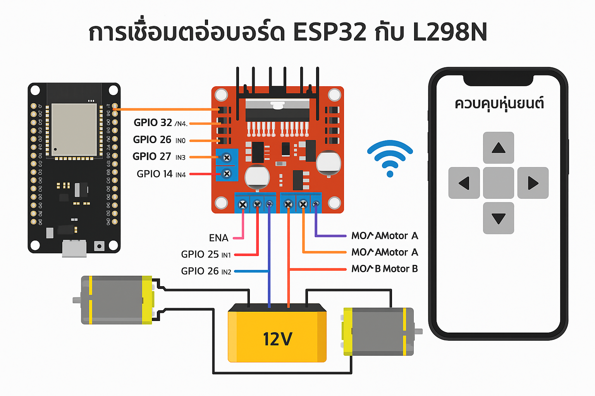

# 🤖 MUT Robot L298N Controller

โครงการควบคุมหุ่นยนต์ด้วยบอร์ด **ESP32 / Arduino** ร่วมกับ **L298N Motor Driver**  
สามารถควบคุมมอเตอร์ 2 ตัวให้ **เดินหน้า / ถอยหลัง / เลี้ยวซ้าย / เลี้ยวขวา / หยุด** ได้  
รองรับการสั่งงานผ่าน **Serial Monitor** หรือ **Wi-Fi (ESP32)**

---

## ✨ คุณสมบัติหลัก

- 🔹 ควบคุมมอเตอร์ DC สองตัวผ่านไดรเวอร์ L298N  
- 🔹 ปรับความเร็วด้วย PWM (0–255)  
- 🔹 ใช้ได้ทั้งบอร์ด **ESP32**, **Arduino UNO**, **Nano**  
- 🔹 รองรับการควบคุมแบบ Serial และ Wi-Fi  
- 🔹 แยกโค้ดเป็น Library (`care_l298n`) ใช้งานซ้ำได้  
- 🔹 มีตัวอย่างโค้ด `.ino` พร้อมใช้งาน  

---

## 📂 โครงสร้างไฟล์ของโปรเจกต์

```
MUT_Robot_L298N/
 ├── care_l298n/              → ไลบรารีควบคุม L298N
 │    └── src/
 │        ├── CARE_L298N.cpp
 │        └── CARE_L298N.h
 ├── control_wifi_robot.ino   → ตัวอย่างควบคุมผ่าน Wi-Fi
 ├── demo_control_robot.ino   → ตัวอย่างควบคุมผ่าน Serial
 └── robotcontroller.apk      → แอป Android สำหรับควบคุมหุ่นยนต์
```

---

## ⚙️ การต่อวงจร (Wiring Diagram)

การเชื่อมต่อบอร์ด **ESP32** กับ **L298N** และมอเตอร์ พร้อมการสื่อสารผ่านแอปมือถือ



| ขา L298N | ขา ESP32 | คำอธิบาย |
|-----------|-----------|-----------|
| IN1       | GPIO 25   | ทิศทางมอเตอร์ A (1) |
| IN2       | GPIO 26   | ทิศทางมอเตอร์ A (2) |
| IN3       | GPIO 27   | ทิศทางมอเตอร์ B (1) |
| IN4       | GPIO 14   | ทิศทางมอเตอร์ B (2) |
| ENA       | GPIO 32 (PWM) | ควบคุมความเร็วมอเตอร์ A |
| ENB       | GPIO 33 (PWM) | ควบคุมความเร็วมอเตอร์ B |
| 12V       | แหล่งจ่ายมอเตอร์ | เช่น แบตเตอรี่ 12V |
| GND       | Ground ร่วมกับ ESP32 | ขาเชื่อมกราวด์ |

---

## 💻 ตัวอย่างการใช้งาน (ผ่าน Serial Monitor)

1. อัปโหลดไฟล์ `demo_control_robot.ino`  
2. เปิด Serial Monitor (ความเร็ว 115200)  
3. พิมพ์คำสั่งเพื่อควบคุมหุ่นยนต์

| คำสั่ง | การทำงาน |
|---------|------------|
| `F` | เดินหน้า |
| `B` | ถอยหลัง |
| `L` | เลี้ยวซ้าย |
| `R` | เลี้ยวขวา |
| `S` | หยุด |

---

## 📶 การควบคุมผ่าน Wi-Fi

1. อัปโหลดไฟล์ `control_wifi_robot.ino`  
2. เชื่อมต่อมือถือเข้ากับ Wi-Fi ของบอร์ด (SSID ที่โค้ดกำหนดไว้)  
3. เปิดแอป **`robotcontroller.apk`** เพื่อควบคุมหุ่นยนต์แบบไร้สาย  
   - ปุ่มลูกศรควบคุมการเคลื่อนไหว  
   - รองรับคำสั่งแบบเรียลไทม์ผ่าน Wi-Fi

---

## 🧩 วิธีติดตั้งไลบรารี `care_l298n`

1. คัดลอกโฟลเดอร์ `care_l298n` ไปไว้ใน  
   ```
   Documents/Arduino/libraries/
   ```
2. เปิด Arduino IDE แล้วไปที่  
   `Sketch → Include Library → CARE_L298N`
3. ใช้งานในโค้ดได้เลย เช่น

```cpp
#include <CARE_L298N.h>
```

---

## 👨‍🔧 ผู้พัฒนา

**Pakprom Naennoi (Peace)**  
โครงการหุ่นยนต์ MUT Robot 2025  

---

## 🪪 License

เผยแพร่ภายใต้สัญญาอนุญาต **MIT License**  
สามารถนำไปใช้งาน ปรับปรุง หรือแจกจ่ายต่อได้  
เพื่อการศึกษาและโครงการส่วนตัวโดยไม่ต้องขออนุญาต

---

> 💬 *"ควบคุมง่าย ใช้งานสะดวก เหมาะสำหรับผู้เริ่มต้นเรียนรู้ระบบหุ่นยนต์"*
