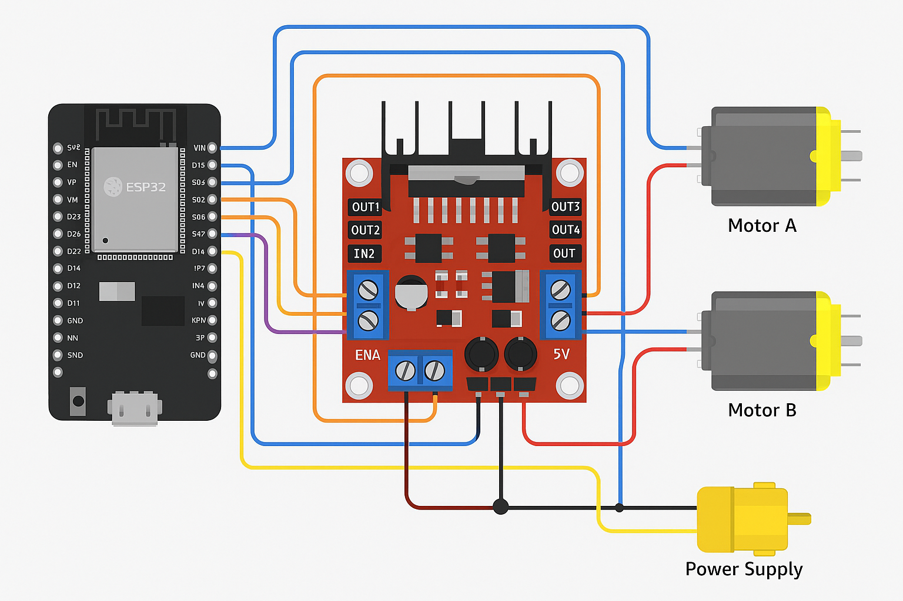

# 🚗 CARE_L298N  
### Cross-Platform L298N Motor Driver Library  
*(Dual Language — English / ภาษาไทย)*  

---

## 🧩 Version / เวอร์ชัน

| Version | Description / รายละเอียด |
|----------|--------------------------|
| **v1.0** | — Support **ESP-IDF v5.xx** and **Arduino Core v3.xx** for ESP32/ESP8266.<br>— Support **AVR** (ATmega328P, 32U4, 2560, 168, etc.).<br>— Compatible with UNO, Nano, Mega, Leonardo, Micro.<br>— Use **Timer0/1/2 Fast PWM mode** for AVR speed control. |

---

## 📘 Overview / ภาพรวม

**CARE_L298N** is a lightweight C++ library for controlling **L298N / L293D** dual H-Bridge motor drivers.  
It supports **ESP32**, **ESP8266**, and **AVR** with direct register-level GPIO control and PWM speed support.

**CARE_L298N** เป็นไลบรารี C++ สำหรับควบคุมมอเตอร์ **L298N / L293D**  
รองรับบอร์ด **ESP32**, **ESP8266**, และ **Arduino AVR**  
ด้วยการเข้าถึงรีจิสเตอร์ GPIO โดยตรง (ไม่ใช้ `digitalWrite()`) และควบคุมความเร็วด้วย PWM

---

### 📁 Suggested file placement
```
/lib/CARE_L298N/
│
├── CARE_L298N.h
├── CARE_L298N.cpp
└── docs/
    └── wiring_esp32_l298n.png
```

---

## 🧭 Wiring Diagram / แผนภาพการต่อวงจร

> 💡 ตัวอย่างการต่อสำหรับ **ESP32 + L298N + DC Motors**

<p align="center">
  
</p>

| L298N Pin | ESP32 GPIO | Description / คำอธิบาย |
|------------|------------|--------------------------|
| ENA | GPIO5 | PWM (Motor A Speed) |
| IN1 | GPIO25 | Motor A Input 1 |
| IN2 | GPIO26 | Motor A Input 2 |
| IN3 | GPIO27 | Motor B Input 1 |
| IN4 | GPIO14 | Motor B Input 2 |
| ENB | GPIO18 | PWM (Motor B Speed) |
| VCC | 5V | Power Supply |
| GND | GND | Common Ground |

> ⚠️ *ถ้าไม่ได้ใช้ ENA/ENB ให้ใช้ “Full PWM Mode” แทน*  
> ระบบจะส่ง PWM ที่ขา IN1–IN4 โดยตรงโดยอัตโนมัติ  

---

## ⚙️ Features / คุณสมบัติเด่น

| English | ภาษาไทย |
|----------|----------|
| Control two DC motors with L298N dual H-Bridge driver | ควบคุมมอเตอร์ DC 2 ตัวด้วย H-Bridge |
| Direction control: forward, backward, left, right, stop | ควบคุมทิศทาง: เดินหน้า ถอยหลัง เลี้ยวซ้าย ขวา หยุด |
| Adjustable PWM (0–255) per motor | ปรับความเร็วด้วย PWM (0–255) |
| Direct GPIO register access (no digitalWrite) | เข้าถึงรีจิสเตอร์ GPIO โดยตรง |
| Compatible with C++11 and later | รองรับ C++11 ขึ้นไป |
| Works on both ESP-IDF and Arduino Core | ใช้งานได้ทั้ง Arduino และ ESP-IDF |

---

## ⚙️ Supported Platforms / แพลตฟอร์มที่รองรับ

| Platform | Status | Note |
|-----------|--------|------|
| ESP32 | ✅ Supported | Tested with LEDC PWM |
| ESP8266 | ✅ Supported | PWM with analogWrite |
| AVR (UNO/Nano/Mega) | ✅ Supported | Timer0/1/2 Fast PWM |
| STM32 (Future) | ⚙️ Planned | Coming soon |

---

## ⚡ Example: ESP32 / ESP8266

```cpp
#include "CARE_L298N.h"

#define IN1 GPIO_NUM_25
#define IN2 GPIO_NUM_26
#define IN3 GPIO_NUM_27
#define IN4 GPIO_NUM_14

CARE_L298N motor(IN1, IN2, IN3, IN4);

void setup() {
  Serial.begin(115200);
  Serial.println("CARE_L298N demo - ESP32");
}

void loop() {
  motor.forward(200);
  delay(2000);
  motor.backward(150);
  delay(2000);
  motor.turn_left(180);
  delay(1000);
  motor.turn_right(180);
  delay(1000);
  motor.stop();
  delay(1000);
}
```

---

## ⚙️ Example: Arduino UNO / Nano (AVR)

```cpp
#define ATMEGAGA_AVR
#include "CARE_L298N.h"

#define IN1 AVR_PIN(D, 2)
#define IN2 AVR_PIN(D, 3)
#define IN3 AVR_PIN(D, 4)
#define IN4 AVR_PIN(D, 7)

CARE_L298N motor(IN1, IN2, IN3, IN4);

void setup() {
  Serial.begin(9600);
  motor.stop();
}

void loop() {
  motor.forward(200);
  delay(2000);
  motor.backward(180);
  delay(2000);
  motor.stop();
  delay(1000);
}
```

---

## 🧩 Serial Command Example / ตัวอย่างคำสั่งผ่าน Serial

```
IN1,255
IN2,100
IN3,200
IN4,0
```

```cpp
if (Serial.available()) {
  static char buffer[32];
  size_t len = Serial.readBytesUntil('\n', buffer, sizeof(buffer) - 1);
  buffer[len] = '\0';

  char *comma = strchr(buffer, ',');
  if (!comma) return;

  *comma = '\0';
  char *pinName = buffer;
  uint8_t speed = atoi(comma + 1);

  gpio_num_t target = GPIO_NUM_NC;
  if      (!strcasecmp(pinName, "IN1")) target = IN1;
  else if (!strcasecmp(pinName, "IN2")) target = IN2;
  else if (!strcasecmp(pinName, "IN3")) target = IN3;
  else if (!strcasecmp(pinName, "IN4")) target = IN4;

  if (target != GPIO_NUM_NC)
    motor.motor_control(target, speed);
}
```

---

## 🧰 Function Summary / สรุปฟังก์ชันหลัก

| Function | Description / คำอธิบาย |
|-----------|--------------------------|
| `forward()` | Move both motors forward |
| `forward(uint8_t speed)` | Move forward at given speed |
| `backward()` | Move both motors backward |
| `backward(uint8_t speed)` | Move backward at given speed |
| `turn_left(uint8_t speed)` | Turn left |
| `turn_right(uint8_t speed)` | Turn right |
| `stop()` | Stop all motors |
| `set_speed(a, b)` | Set speed for motor A/B |
| `motor_control(INx, speed)` | Set PWM directly on INx pin |

---

## ⚙️ PWM Configuration (ESP32)

| Macro | Default | Description |
|--------|----------|-------------|
| `PWM_FREQ` | 5000 | PWM Frequency (Hz) |
| `PWM_RES` | `LEDC_TIMER_8_BIT` | PWM Resolution (8–12 bit) |
| `PWM_MODE` | `LEDC_HIGH_SPEED_MODE` | LEDC speed mode |
| `PWM_TIMER` | `LEDC_TIMER_0` | PWM timer used |

> 🔧 To use **12-bit PWM**, modify:
> ```cpp
> #define PWM_RES LEDC_TIMER_12_BIT
> duty = (speed * ((1 << PWM_RES) - 1)) / 255;
> ```

---

## 🧾 Changelog / บันทึกการเปลี่ยนแปลง

| Version | Date | Details |
|----------|------|----------|
| v1.0 | Oct 2025 | Initial release with ESP32/ESP8266/AVR support |

---

## 👨‍💻 Author / ผู้พัฒนา

**Pakprom Naennoi (Peace)**  
📧 pakprom@mut.ac.th  
🏢 CARE Engineering Team  
📅 October 2025  

> “Fast, Portable, and Clean — For Makers Who Want Performance.”  
> “เร็ว เรียบง่าย ใช้ได้ทุกบอร์ด สำหรับคนทำจริง.”

---

## 📜 License / ใบอนุญาต

Licensed under the **MIT License**.  
You are free to use, modify, and distribute this software.  
สามารถใช้งาน ดัดแปลง และแจกจ่ายได้โดยอิสระ ภายใต้เงื่อนไขของ MIT License.

---